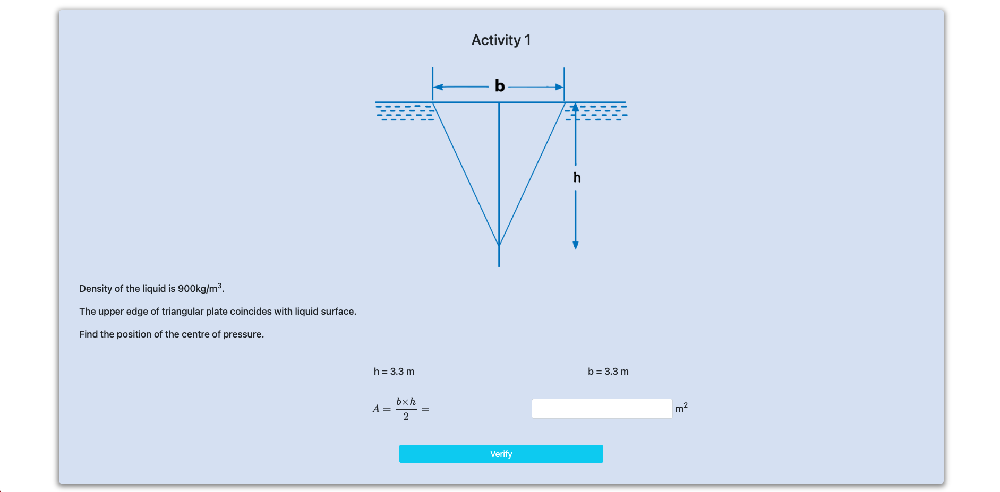
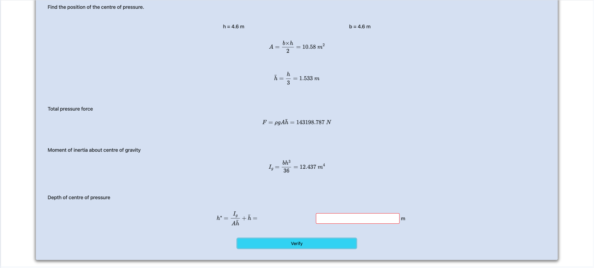
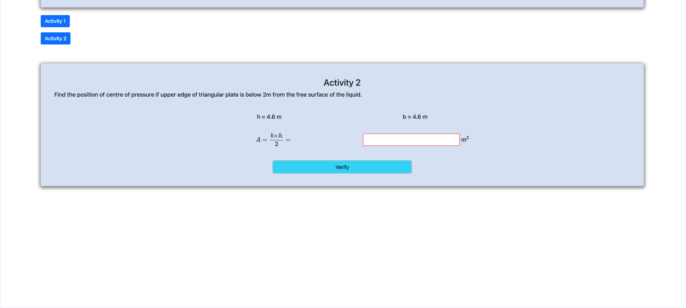
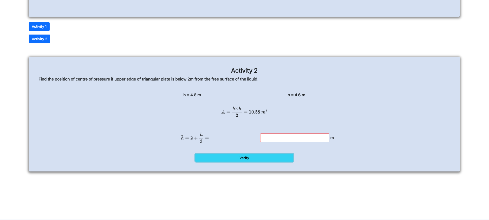
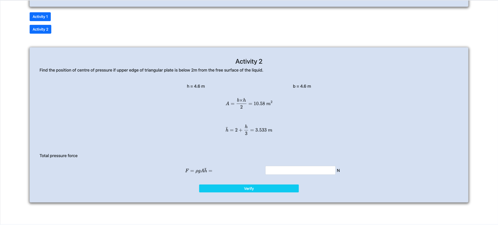
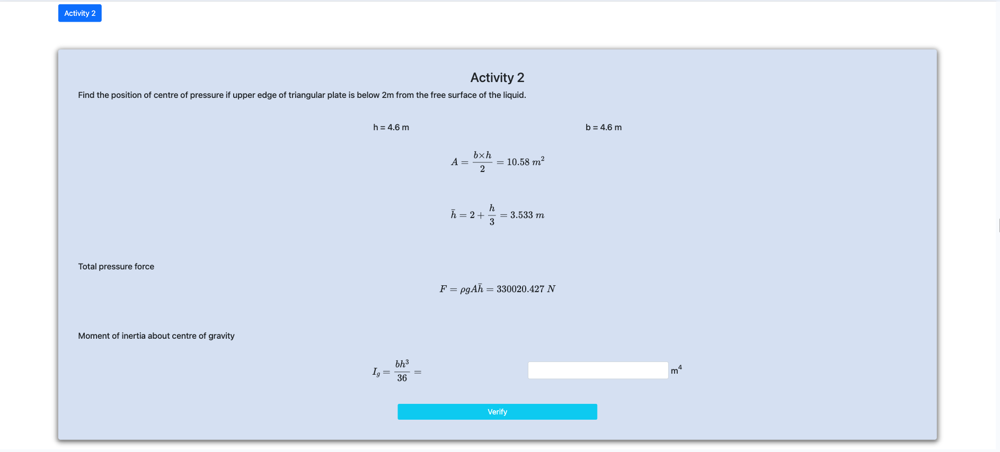
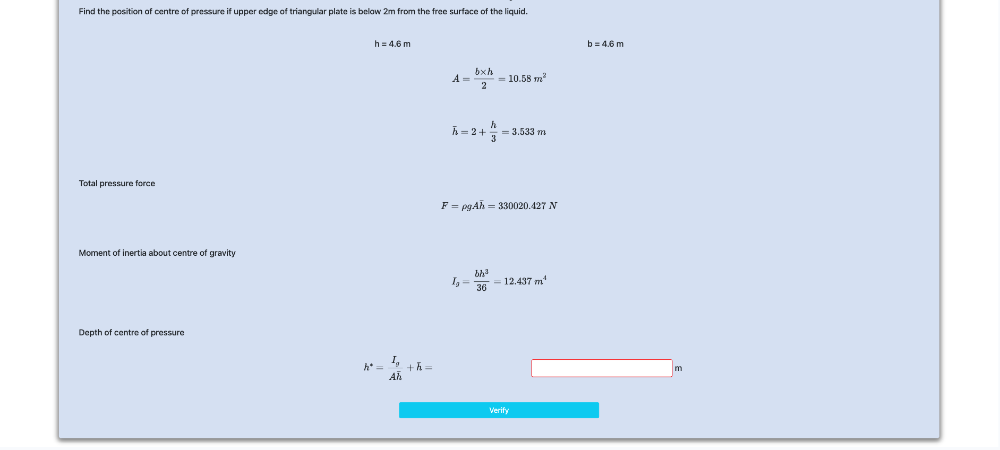

<h2>Follow the below steps to perform the experiment on the simulator</h2>
 

Step 1 : Click next to start.

Step 2 : Calculate position of center of pressure

Step 3 : Calculate h bar

Step 4 : Calculate total pressure force

Step 5 : Calculate moment of inertia about center of gravity

Step 6 : Calculate depth of centre of pressure 

Step 7 : New Activity starts, calculate A 

Step 8 : Calculate h bar

Step 9 : Calculate total pressure force

Step 10 : Calculate moment of inertia about center of gravity

Step 11 : Calculate depth of centre of pressure

